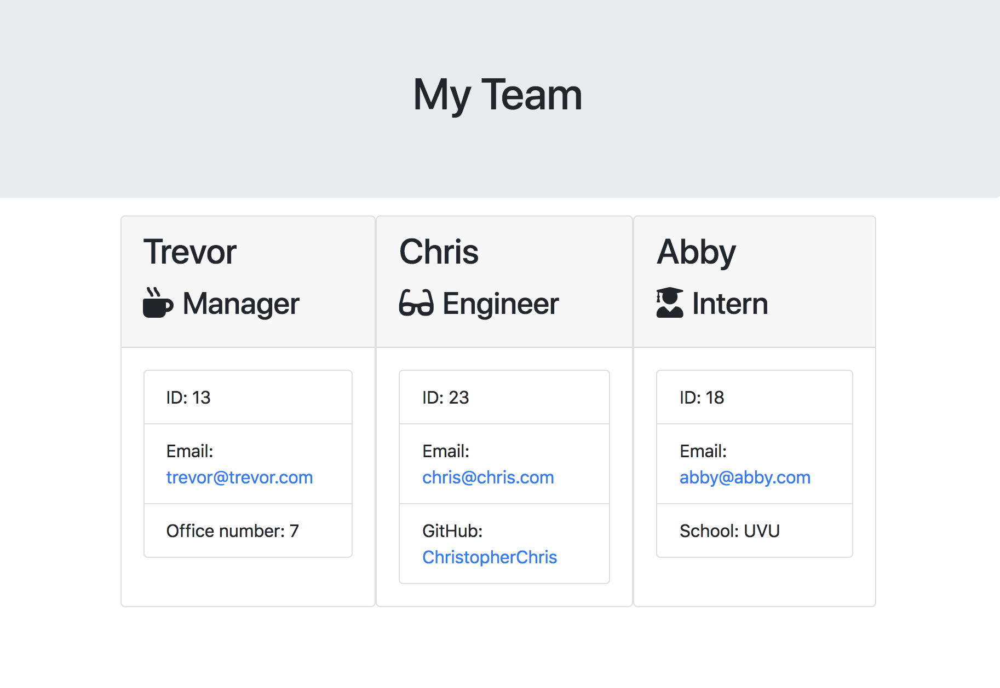

## The Process

for this application I built a software engineering team generator command line application. The application prompts the user for information about the team manager and then information about the team members. The user can input any number of team members, and they may be a mix of engineers and interns. When the user has completed building the team, the application will create an HTML file that displays a nicely formatted team roster based on the information provided by the user.

```
As a manager
I want to generate a webpage that displays my team's basic info
so that I have quick access to emails and GitHub profiles
```

### User input

Prompts the user to build an engineering team.
This project generates a `team.html` page in the `output` directory. And Prompts the user with these following prompts.

  * Name
  * Email
  * ID
  * Role

  * Role-specific property (School, link to GitHub profile, or office number)

The user can user can test in node using `npm run test`, and run the application in node using `node app.js`.

### installation instructions

Use npm init to create a package.json, and then npm i in the package.json to download dependencies.

### Screenshot of app

